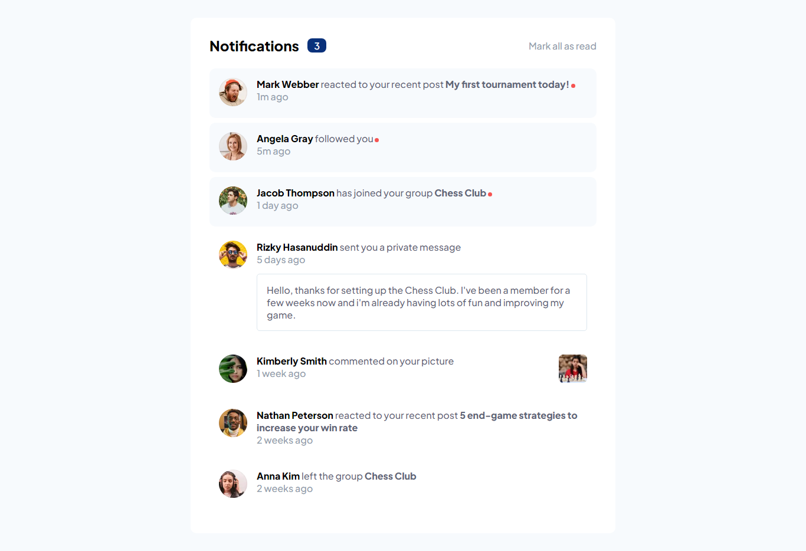
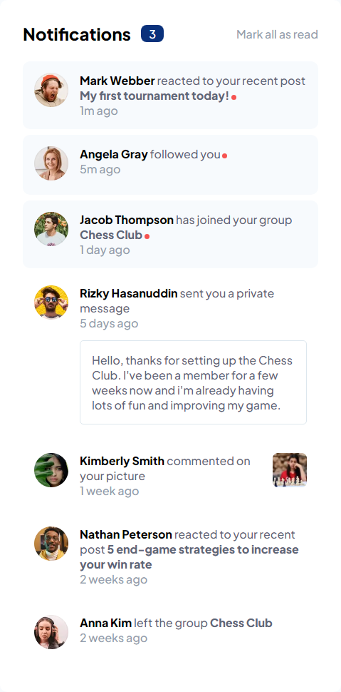

# Frontend Mentor - Notifications page solution

This is a solution to the [Notifications page challenge on Frontend Mentor](https://www.frontendmentor.io/challenges/notifications-page-DqK5QAmKbC). Frontend Mentor challenges help you improve your coding skills by building realistic projects.  

## Table of contents

- [Overview](#overview)
  - [The challenge](#the-challenge)
  - [Screenshot](#screenshot)
  - [Links](#links)
- [My process](#my-process)
  - [Built with](#built-with)
  - [What I learned](#what-i-learned)
- [Author](#author)

## Overview

### The challenge

Users should be able to:

- Distinguish between "unread" and "read" notifications
- Select "Mark all as read" to toggle the visual state of the unread notifications and set the number of unread messages to zero
- View the optimal layout for the interface depending on their device's screen size
- See hover and focus states for all interactive elements on the page

### Screenshot
#### Desktop

#### Mobile

### Links

- Solution URL: [Solution URL](https://www.frontendmentor.io/solutions/responsive-notifications-page-using-react-typescript-NuscFT6moN)
- Live Site URL: [Live Site](https://notifications-page-pi-eight.vercel.app/)

## My process

### Built with

- HTML
- CSS
- JavaScript
- React
- CSS Module
- TypeScript

### What I learned

- Portuguese Version:
  Este projeto me ajudou a praticar os meus conhecimentos em typescript, controle de estados e CSS condicional.

- English Version:
  This project helped me to practice my knowledge in typescript, state control and conditional CSS.

## Author

- Linkedin - [Linkedin João Victor Mendes Silva](https://www.linkedin.com/in/joaovictormendessilva/)
- Frontend Mentor - [@joaovictormendessilva](https://www.frontendmentor.io/profile/joaovictormendessilva)
